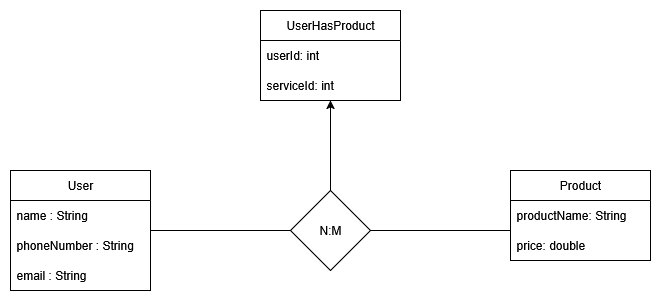
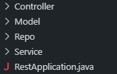
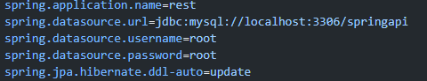
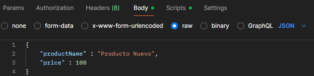
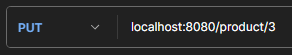
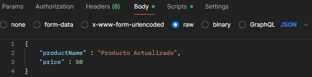
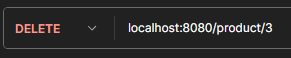

# ⚙️ API REST Springboot Java
API Rest hecha con el framework **Springboot** utilizando el lenguaje **Java** con base de datos **MYSQL** en un entorno local.

## 💾 Esquema de la base de datos

La base de datos es una sencilla relación entre un usuario y los distintos productos que puede tener asociados, creando una relación n:m lo que prepara el escenario para probar los distintos endpoints que utiliza una API en un entorno de producción.

## 🗂️ Estructura del proyecto

Para dividir la logica de la API he utilizado la siguiente estructura:

**Controladores:**  Son los archivos en los que se encuentran los **endpoints** y que reciben las peticiones a la API.

**Modelos:** Son los archivos que **contienen la informacion de las distintas entidades** que formarán la base de datos.

**Repositorios:** Son los archivos que **se encargan de hacer las operaciones contra la base de datos** de manera transparente al usuario utilizando **JPA** (Java Persistence API)

**Servicios:** Son los archivos que **contienen la logica de los distintos endpoints de la API**. Son invocados desde los controladores.

**RestApplication:** Es el archivo por defecto que tiene el proyecto al crearlo y el que **se utiliza para iniciar la aplicación**.

## 🐬 Configuración de la base de datos

En el archivo **application.properties** se establecen los distintos parámetros que necesita la api para poder conectarse a la base de datos. En este caso, la información está hardcodeada, pero en un entorno real serían parámetros obtenidos de forma externa.

Para probar la aplicación de manera local **hay que modificar los datos de la url (modificando el nombre del esquema que aparece delante de la ultima "/" y el puerto en caso de que se haya modificado y no sea 3306), el nombre de usuario y la contraseña para que coincidan con los que se van a usar en MySQL Workbench**

## 🧪 Como utilizar la API

Para ejemplificar este apartado utilizaré la tabla de los productos. Los endpoints permiten realizar un **CRUD** completo el cual se puede probar usando una aplicación como **Postman**, habiendo previamente iniciado la API.

### Post (*Create*)

Para hacer estas peticiones hay que **indicar en el cuerpo de la petición los datos** con los que se va a crear el producto.

 

### Get (*Read*)

Este tipo de peticiones se pueden hacer de forma general, obteniendo todos los resultados (**devolviendo una lista de objetos**) u obteniendo uno especifico (**devolviendo un objeto**) indicando el id en la ruta del endpoint.

 

### Put (*Update*)

Para estas peticiones, hay que indicar en la ruta de la misma el **id del producto que queremos actualiza**r y en el cuerpo **establecer los nuevos valores**.

 

### Delete

Para utilizar esta petición hay que **indicar el id del producto que se quiere borrar** de la base de datos en la ruta.

 
