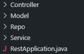

# API REST Springboot Java
API Rest hecha con el framework **Springboot** utilizando el lenguaje **Java** con base de datos **MYSQL** en un entorno local.

## Esquema de la base de datos

La base de datos es una sencilla relación entre un usuario y los distintos productos que puede tener asociados, creando una relación n:m lo que crea el escenario para probar los distintos endpoints que utiliza una API en un entorno de producción.

## Estructura del proyecto

Para dividir la logica de la API he utilizado la siguiente estructura:

**Controladores:**  Son los archivos en los que se encuentran los **endpoints** y que reciben las peticiones a la API.

**Modelos:** Son los archivos que **contienen la informacion de las distintas entidades** que formarán la base de datos.

**Repositorios:** Son los archivos que **se encargan de hacer las operaciones contra la base de datos** de manera transparente al usuario utilizando **JPA** (Java Persistence API) e **Hibernate**

**Servicios:** Son los archivos que **contienen la logica de los distintos endpoints de la API**. Son invocados desde los controladores.

**RestApplication:** Es el archivo por defecto que tiene el proyecto al crearlo y el que **se utiliza para iniciar la aplicación**.

