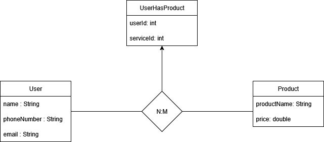

# API REST Springboot Java
API Rest hecha con el framework **Springboot** utilizando el lenguaje **Java** con base de datos **MYSQL** en un entorno local.

**Esquema de la base de datos
La base de datos es una sencilla relación entre un usuario y los distintos productos que puede tener asociados, creando una relación n:m lo que crea el escenario para probar los distintos endpoints que utiliza una API en un entorno de producción.

